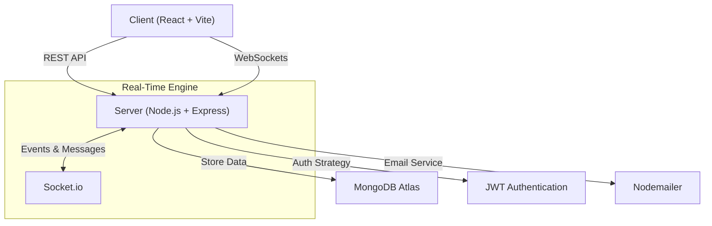

# 🎓 AlumniConnect - Bridging the Gap Between Students & Alumni

<div align="center">
  
  
  
  
  <br/>
  <br/>
</div>

---

## 🚀 Overview
**AlumniConnect** is a comprehensive professional networking platform designed to foster meaningful, high-impact connections between university students and alumni.

It eliminates the traditional communication gap by creating a **dedicated digital ecosystem** for:

- Mentorship  
- Job referrals  
- Career guidance  
- Knowledge sharing  
- Community engagement  

Unlike static alumni directories, AlumniConnect delivers **real-time interaction**, **live event collaboration**, and an **intelligent opportunity marketplace**—empowering students to accelerate their professional journey with direct alumni support.

---

## ✨ Key Features

### 🤝 Connectivity & Communication
- **Real-Time Chat:** Powered by **Socket.io** for seamless, low-latency messaging between students and alumni.  
- **Structured Mentorship:** Students can request mentorship sessions; alumni manage availability and approvals.  

### 💼 Career Growth
- **Job & Internship Portal:** Alumni post verified opportunities directly from their organizations.  
- **Referral-Ready Applications:** Streamlined referral workflow to improve hiring outcomes.  

### 📅 Events & Community
- **Event Management System:** Host webinars, reunions, workshops, and networking sessions.  
- **Community Feed:** Social-style timeline for achievements, announcements, and discussions.  

### 🛡️ Security & Role Management
- **RBAC Architecture:** Separate dashboards for **Students**, **Alumni**, and **Admins**.  
- **Secure Authentication:** JWT-based auth with **Bcrypt-encrypted credentials**.  

---

## 🏗️ System Architecture

The application is built on the **MERN Stack** (MongoDB, Express, React, Node.js) with a focus on scalability and real-time interaction.



## 🛠️ Tech Stack

| Domain | Technologies |
|--------|-------------|
| **Frontend** | React.js, Vite, Tailwind CSS, Axios, Lucide Icons |
| **Backend** | Node.js, Express.js, Socket.io |
| **Database** | MongoDB with Mongoose ODM |
| **Authentication** | JWT, Bcrypt.js |
| **Utilities** | Nodemailer, Multer, Dotenv |

---

## ⚡ Getting Started

Follow these steps to run the project locally.

### 1️⃣ Clone the Repository

```bash
git clone https://github.com/yourusername/alumniconnect.git
cd alumniconnect
```

---

### 2️⃣ Backend Setup (Server)

```bash
cd server
npm install
```

Create a `.env` file inside the **server** directory:

```env
PORT=5000
MONGO_URI=your_mongodb_connection_string
JWT_SECRET=your_super_secret_key
EMAIL_USER=your_email@gmail.com
EMAIL_PASS=your_email_password
CLIENT_URL=http://localhost:5173
```

Start the backend server:

```bash
npm start
```

---

### 3️⃣ Frontend Setup (Client)

Open a new terminal:

```bash
cd client
npm install
npm run dev
```

---

### 4️⃣ Access the Application

Visit in your browser:

```
http://localhost:5173
```

---

## 📂 Project Structure

```bash
alumniconnect/
├── client/                # React Frontend
│   ├── src/
│   │   ├── components/    # Reusable UI Components
│   │   ├── pages/         # Route Pages (Home, Dashboard, Chat)
│   │   ├── utils/         # API Helpers
│   │   │   └── api.js
│   │   └── App.jsx        # Root Component
│
├── server/                # Node.js Backend
│   ├── config/            # Database Connection
│   ├── controllers/       # Business Logic (Auth, Jobs, Events)
│   ├── models/            # Mongoose Schemas
│   ├── routes/            # REST API Endpoints
│   └── index.js           # Server Entry Point
```

---

## 🤝 Contribution

Contributions are welcome and encouraged.

**To contribute:**
1. Fork the repository  
2. Create a new feature branch  
3. Commit your enhancements  
4. Submit a pull request  

Future roadmap ideas include:

- Video mentorship calls  
- AI-powered job recommendations  
- Resume review automation  
- University-level analytics dashboard  

---

## 📜 License

This project is licensed under the **MIT License**.

---

## 👨‍💻 Author

**ADITYA | SOFTWARE DEVELOPER**  

---

## 🌍 Vision

AlumniConnect is not just another college project.  
It is a **scalable professional networking ecosystem** built to:

- Strengthen alumni-student collaboration  
- Improve career accessibility  
- Enable real mentorship at scale  
- Digitally transform campus communities  

**Built to evolve into the LinkedIn-style platform for universities worldwide.**
